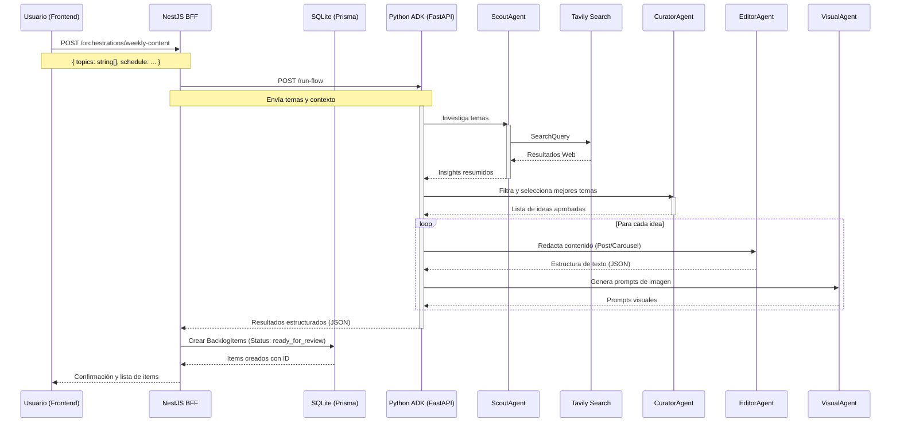

## 8. Arquitectura del Sistema

### 8.1 Diagrama de Flujo de Datos (Mermaid)

Este diagrama representa el flujo de información desde que el usuario solicita la generación de contenido hasta que se guarda en el backlog.



### 8.2 Diagrama de Componentes (ASCII)

Representación visual de la estructura del monorepo y las responsabilidades de cada módulo.

```ascii
+-----------------------------------------------------------------------+
|                          LAURIO MONOREPO                              |
+-----------------------------------------------------------------------+
|                                                                       |
|   +-------------------+       +-------------------+                   |
|   |   APPS/FE-PANEL   |       |   APPS/BFF-PANEL  |                   |
|   | (Next.js + React) |<----->| (NestJS + Prisma) |                   |
|   +-------------------+  HTTP | +-----------------+                   |
|             |                 |         |                             |
|             | User UI         |         | Orchestration Logic         |
|             v                 |         v                             |
|   +-------------------+       |   +-------------------+               |
|   |      Browser      |       |   |    SQLite DB      |               |
|   +-------------------+       |   +-------------------+               |
|                               |                                       |
|                               |         ^ HTTP (Internal)             |
|                               |         |                             |
|                               |         v                             |
|                               |   +-------------------+               |
|                               |   |   APPS/ADK-AGENT  |               |
|                               |   | (FastAPI Python)  |               |
|                               |   +-------------------+               |
|                               |             |                         |
|                               |             | Agents Logic            |
|                               |             v                         |
|                               |   +-------------------+               |
|                               |   |  Google Gemini    |               |
|                               |   |  + Tavily Search  |               |
|                               |   +-------------------+               |
|                                                                       |
+-----------------------------------------------------------------------+
|   PACKAGES/SHARED (TypeScript Interfaces, DTOs, Constants)            |
+-----------------------------------------------------------------------+
```

### 8.3 Descripción de Componentes

1.  **fe-panel (Frontend):**
    *   Interfaz de usuario construida con Next.js 14 (App Router).
    *   Permite ingresar temas, configurar horarios y visualizar el backlog.
    *   Se comunica exclusivamente con el BFF.

2.  **bff-panel (Backend for Frontend):**
    *   Servidor NestJS que maneja la lógica de negocio y persistencia.
    *   Actúa como intermediario entre el usuario y el sistema de IA.
    *   Administra la base de datos SQLite mediante Prisma ORM.
    *   Calcula fechas de publicación (`plannedDate`) basado en la configuración de horario.

3.  **adk-agent (AI Service):**
    *   Servicio independiente en Python usando FastAPI.
    *   Implementa la lógica de agentes inteligentes (Scout, Curator, Editor, Visual).
    *   Utiliza Tavily para búsqueda web y Gemini para generación de contenido.
    *   Retorna resultados estructurados en JSON listos para ser consumidos por el BFF.

4.  **shared (Library):**
    *   Paquete compartido que contiene definiciones de tipos (TypeScript) usadas por el Frontend y el BFF.
    *   Garantiza consistencia en los contratos de datos (ej. `BacklogItem`).
